# TRABAJO-EXTRA-2

1.- OBJETIVOS

Objetivo General:
- Realizar una aplicación móvil, mediante la herramienta de App inventor para la conversión de fasores y operaciones con fasores, y así obtener una interfaz que se pueda visualizar los diferentes cálculos de los fasores tanto polares como rectangulares.

Objetivos especificos:

- Identificar las diversas herramientas que nos proporciona App inventor para el control de sus funciones.

- Visualizar las diferentes operaciones que se pueden hacer para el correcto cálculo de los fasores polares y rectangulares.

- Utilizar diversas interfaces para cada función del programa tanto para la organización como la facilidad de uso.

2.- Marco Teorico:

App inventor es un software de programación por medio de bloques, la cual permite crear aplicaciones móviles de forma muy sencilla, por lo que es accesible a todo público. Es abierto a todo público, ya que su programación es demasiado visual e intuitivo para realizar cualquier aplicación, al estilo de un juego.
Esta herramienta proporciona una librería de bloques gráficas de comandos, con diferentes formas y colores para diferenciar las funciones de cada uno, estos se agrupan mediante una cadena, por medio del acople de bloques.

Esta herramienta es creada por el MIT y Google education, la cual fue hecha por estudiantes y personal de la institución dirigida por Hal Abelson, la cual fue actualizando para el desarrollo de mejoras y compatibilidad a la accesibilidad a cualquier persona.

Las ventajas de App inventor son:

- Herramienta 100 % gratuita. 

- Permite crear aplicaciones directamente desde tu navegador web, solo necesitas acceder a su página web y crear en línea. 

- Aprendizaje visual por bloques de código. 

- Puedes crear app para sistema operativo Android o iOS. 

- Fácil comprobación de la usabilidad de la aplicación desarrollada gracias a la aplicación App Inventor disponible para teléfonos móviles.

Las opciones de creación y edición son proyectos que ayuda a crear y editar nuestros proyectos, el apartado de conectar es para exportar a la aplicación móvil directamente mediante un código QR, para utilizar el programa en un smartphone.
En la parte de galería es nuestro acceso a las aplicaciones compartidas por la comunidad, en el sitio de diseñador permite acceder a la ventana de diseño para colocar objetos que forman parte de la interfaz gráfica.

Los bloques que se utilizaron son:

El bloque de accionamiento del botón produciendo un set del método label, ya que con los bloques tipo texto actuaran como nuestro resultado.
Los bloques azules son aquellos para operaciones matemáticas y lo amarillos para acciones, como antes mencionado se dividen en colores las operaciones que se pueden hacer tanto lógicas, listas y diccionarios.

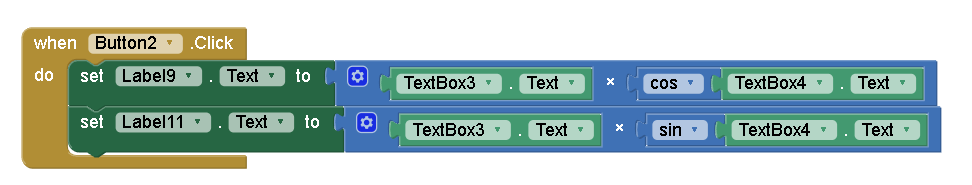

Los bloques rojos serán de ayuda para realizar un cambio de pantalla, estos se utilizan para que se organice de mejor manera la distribución de funciones del programa.

3.- Procedimiento

Primeramente, debemos ingresar al sitio de app inventor en su sitio web y vamos al apartado de crear una app.

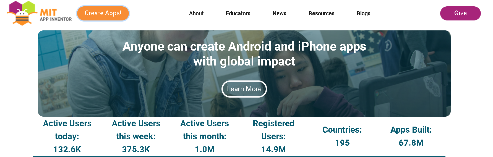

Se nos desplegara una ventana donde podemos ver todos nuestros proyectos en una lista, pero para iniciar damos click en nuevo proyecto, cabe recalcar que l a pagina podemos tenerla en español o en inglés, pero como dicen en las buenas prácticas de programación el lenguaje que se utiliza generalmente es el inglés.

En este espacio veremos nuestra interfaz vista en un smartphone, por lo cual aquí únicamente podemos utilizar las diversas herramientas para modificar la interfaz tanto botones o como textos.

Creamos nuestra interfaz para la conversión de fasores, con sus botones para cambiar a otra pestaña o ventana

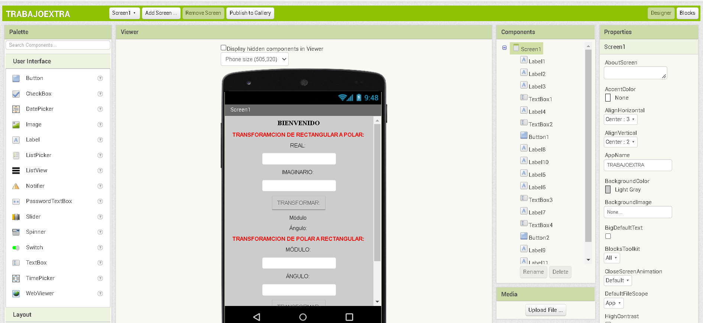

Aquí podemos ver en el apartado del diagrama de bloques para programar lo que va hacer cada una de las herramientas utilizadas.

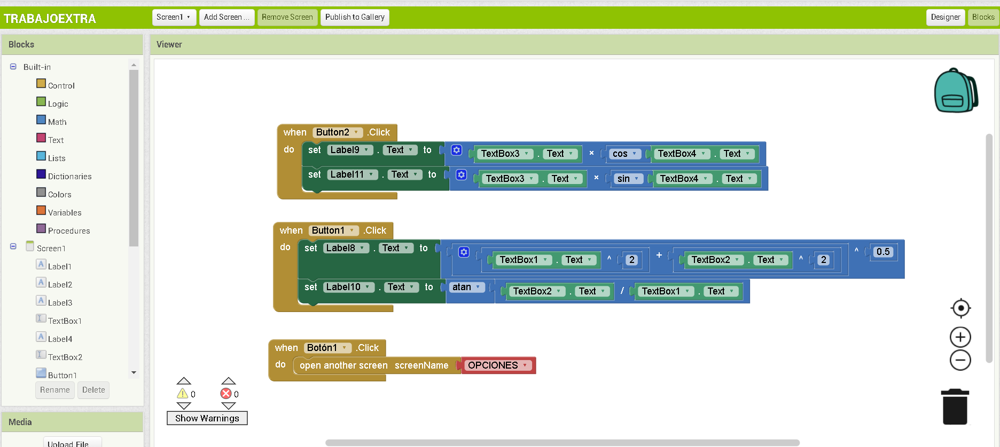

En el espacio de arriba del proyecto podemos crear nuevas ventanas para la organización del software.

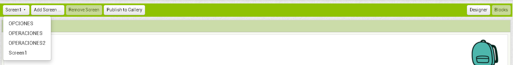

Tenemos un menú de opciones para las diferentes operaciones con fasores, si son polares o rectangulares, y también para regresar al inicio para la transformación de estas.

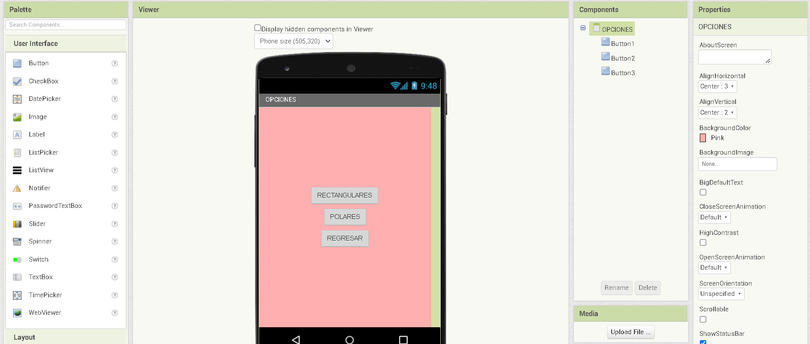

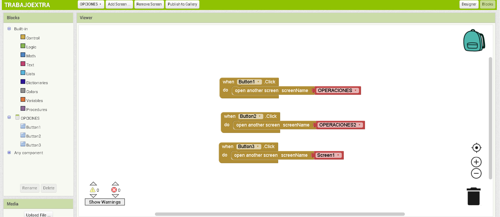

En esta ventana tenemos las operaciones con fasores en su forma rectangular, la cual son números complejos con su parte real, teniendo operaciones como suma, resta, multiplicación y 
división.

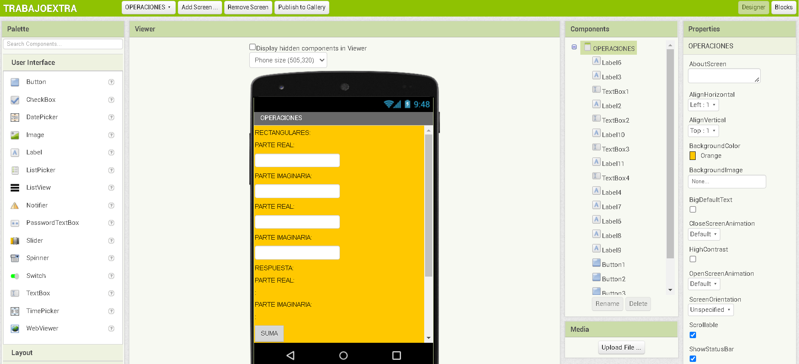

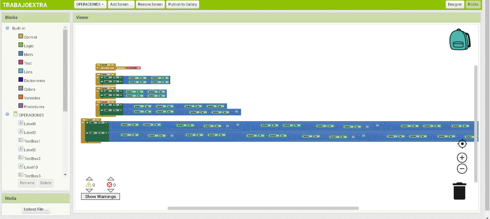

En este apartado tenemos las operaciones con fasores polares las cuales tienen un módulo y un ángulo, estos fasores únicamente pueden hacer las operaciones de división y 
multiplicación.

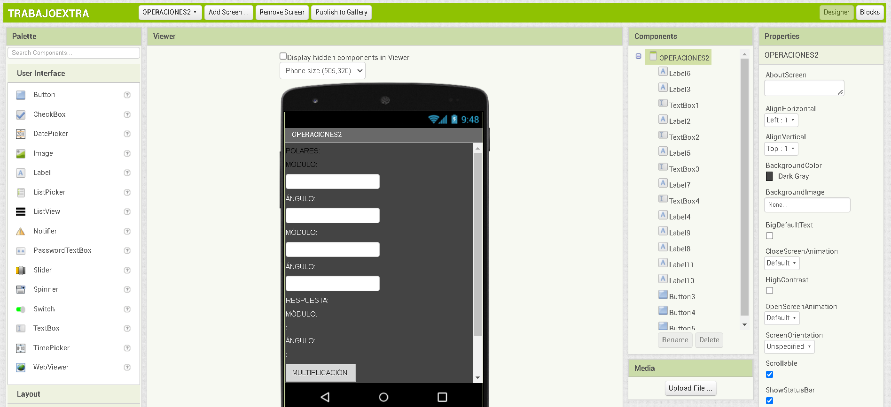

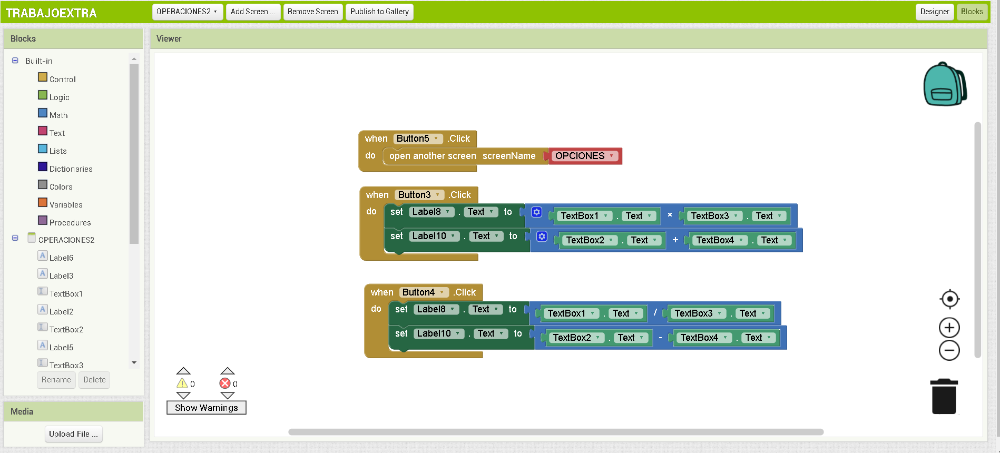

4.- Resultados

Para observar los resultados debemos ir a la parte de conectar para utilizarla en el celular.

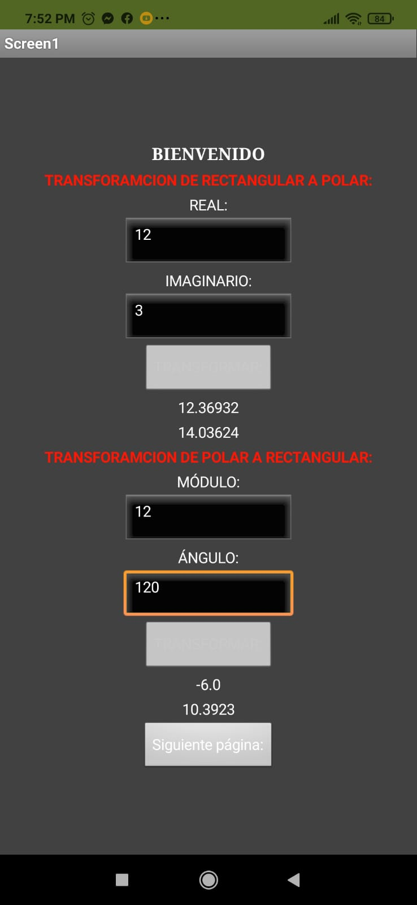

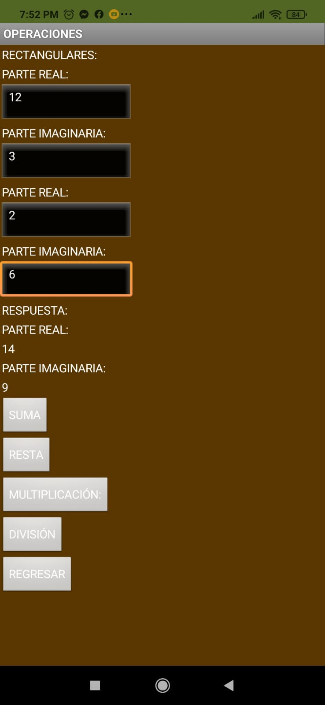

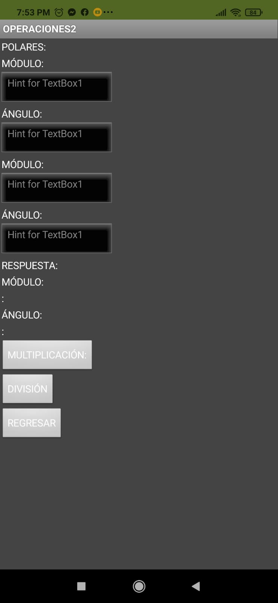

5.- Video

6.- Conclusiones

- Las herramientas que se utilizaron son los user interface de app inventor y también los bloques de colores con diferentes funciones para la cual nos ayuda a ver resultados, botones de cálculo y pantallas de cada operación.

- Los valores serán determinados en el apartado de bloques de la aplicación donde se programará, tal que cambiemos los títulos de cada herramienta visual y las constantes que se deben utilizar.

- Modificamos los colores y el centrado de las palabras de cada operación, y establecemos los títulos de cada uno con sus respectivas funciones dentro de las pantallas.

7.- Bibliografia.

- EcuRed. (s. f.). MIT App Inventor - EcuRed. Ecu Red. Recuperado 2 de marzo de 2022, de https://www.ecured.cu/MIT_App_Inventor

- Bustamante, E. G. (2021, 2 noviembre). ¿Qué es App Inventor y para qué sirve? Spacetechies. Recuperado 2 de marzo de 2022, de https://www.spacetechies.com/que-es-app-inventor-y-para-que-sirve/

- Licer, A. L. N. (2014, 13 enero). ¿Qué es el App Inventor? ¿Para qué sirve? APP Moviles. Recuperado 2 de marzo de 2022, de https://appmoviles.net/que-es-el-app-inventor-para-que-sirve/
